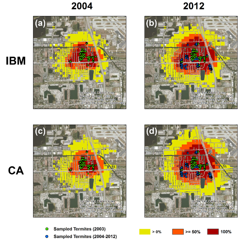

# Spatiotemporal Simulation of Invasive Species Spread

This repository has three folders: [CA](CA), [IBM](IBM), and [Tangible Landscape](Tangible_Landscape).

The IBM folder contains all R scripts used to develop the termite dispersal individual-based simulation presented in the research article published by:

Tonini, F., Hochmair, H. H., Scheffrahn, R. H., and DeAngelis, D. L. (2013). [Simulating the spread of an invasive termite in an urban environment using a stochastic individual-based model](http://www.bioone.org/doi/abs/10.1603/EN12325). *Environmental Entomology*, 42 (3), pp. 412-423. DOI: http://dx.doi.org/10.1603/EN12325

The CA folder contains all R scripts used to develop the grid-based termite dispersal simulation model presented in the research article published by:

Tonini, F., Hochmair, H. H., Scheffrahn, R. H., and DeAngelis, D. L. (2014). [Stochastic spread models: A comparison between an individual-based and a lattice-based model for assessing the expansion of invasive termites over a landscape](http://www.sciencedirect.com/science/article/pii/S1574954114001277#). *Ecological Informatics*, 24, pp. 222-230.

The Tangible Landscape folder contains all R scripts used for the integration of the CA dispersal simulation into [Tangible Landscape](https://geospatial.ncsu.edu/osgeorel/tangible-landscape.html), as part of a collaboration while at the [Center for Geospatial Analytics](https://cnr.ncsu.edu/geospatial/), North Carolina State University. The scripts used here are based off the CA (grid-based) approach mentioned above.

Please check out the README files inside each main folder for more detailed instructions on how to set up and run the scripts.

